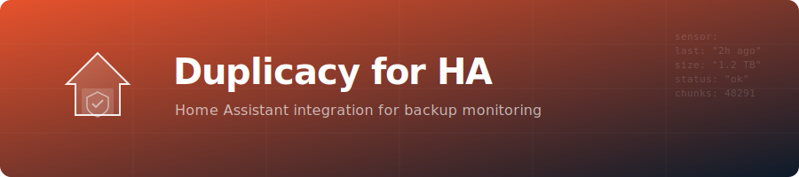

<p align="center">
  
</p>

# Duplicacy Backup Monitor for Home Assistant

[](https://hacs.xyz)
[](https://github.com/GeiserX/duplicacy-ha/actions/workflows/tests.yml)
[](https://codecov.io/gh/GeiserX/duplicacy-ha)
[](https://www.home-assistant.io)
[](https://github.com/GeiserX/duplicacy-ha/stargazers)
[](LICENSE)

A Home Assistant custom integration that monitors [Duplicacy](https://duplicacy.com) backups through the [duplicacy-exporter](https://github.com/GeiserX/duplicacy-exporter) Prometheus exporter.

Get real-time backup status, progress, speed, and historical metrics directly in your Home Assistant dashboard.

## Prerequisites

A running instance of [duplicacy-exporter](https://github.com/GeiserX/duplicacy-exporter) that exposes `/metrics` (Prometheus format) and `/health` endpoints.

## Installation

### HACS (Recommended)

1. Open HACS in Home Assistant.
2. Go to **Integrations** and click the three-dot menu.
3. Select **Custom repositories**.
4. Add `https://github.com/GeiserX/duplicacy-ha` with category **Integration**.
5. Search for "Duplicacy Backup Monitor" and install it.
6. Restart Home Assistant.

### Manual

1. Copy the `custom_components/duplicacy` directory into your Home Assistant `config/custom_components/` directory.
2. Restart Home Assistant.

## Configuration

1. Go to **Settings > Devices & Services > Add Integration**.
2. Search for **Duplicacy Backup Monitor**.
3. Enter the URL of your duplicacy-exporter (default: `http://localhost:9750`).
4. The integration will verify the connection and create all entities.

A separate HA device is created for each unique backup job (identified by snapshot ID and storage target). Each device contains all applicable sensors and binary sensors.

## Entities

### Sensors

| Entity | Description | Unit | Device Class |
|--------|-------------|------|--------------|
| Last successful backup | Timestamp of the most recent successful backup | - | Timestamp |
| Last backup duration | How long the last backup took | seconds | Duration |
| Backup speed | Current upload speed during a running backup | B/s | Data Rate |
| Backup progress | Current backup completion percentage | % | - |
| Bytes uploaded (last) | Bytes uploaded in the last backup | bytes | Data Size |
| New bytes (last) | New bytes detected in the last backup | bytes | Data Size |
| Total files (last) | Number of files processed in the last backup | - | - |
| New files (last) | Number of new files in the last backup | - | - |
| Last exit code | Exit code of the last backup (0 = success, 1 = failure) | - | - |
| Last revision | Revision number of the last backup | - | - |
| Chunks uploaded | Chunks currently being uploaded | - | - |
| Chunks skipped | Chunks skipped (already present) | - | - |
| New chunks (last) | New chunks created in the last backup | - | - |
| Total bytes uploaded | Cumulative bytes uploaded (monotonically increasing) | bytes | Data Size |
| Last successful prune | Timestamp of the most recent successful prune operation | - | Timestamp |

### Binary Sensors

| Entity | Description | Device Class |
|--------|-------------|--------------|
| Backup running | Whether a backup is currently in progress | Running |
| Prune running | Whether a prune operation is currently in progress | Running |

## Example Automations

### Alert on Backup Failure

```yaml
automation:
  - alias: "Duplicacy backup failed"
    trigger:
      - platform: state
        entity_id: sensor.documents_b2_last_exit_code
        to: "1"
    action:
      - service: notify.mobile_app
        data:
          title: "Backup Failed"
          message: "Duplicacy backup for 'documents' to B2 has failed."
```

### Alert if No Backup in 24 Hours

```yaml
automation:
  - alias: "Duplicacy no backup in 24h"
    trigger:
      - platform: template
        value_template: >
          {{ as_timestamp(now()) - as_timestamp(states('sensor.documents_b2_last_successful_backup')) > 86400 }}
    action:
      - service: notify.mobile_app
        data:
          title: "Backup Overdue"
          message: "No successful Duplicacy backup for 'documents' to B2 in the last 24 hours."
```

## Links

- [duplicacy-exporter](https://github.com/GeiserX/duplicacy-exporter) - The Prometheus exporter this integration connects to
- [Duplicacy](https://duplicacy.com) - Lock-free deduplication cloud backup tool
- [HACS](https://hacs.xyz) - Home Assistant Community Store

## Other Home Assistant Integrations by GeiserX

- [cashpilot-ha](https://github.com/GeiserX/cashpilot-ha) — Passive income earnings sensors
- [genieacs-ha](https://github.com/GeiserX/genieacs-ha) — TR-069 router management sensors
- [pumperly-ha](https://github.com/GeiserX/pumperly-ha) — Fuel and EV charging price sensors


## Related Projects

| Project | Description |
|---------|-------------|
| [duplicacy-cli-cron](https://github.com/GeiserX/duplicacy-cli-cron) | Docker-based encrypted dual-storage backup automation using Duplicacy CLI |
| [duplicacy-exporter](https://github.com/GeiserX/duplicacy-exporter) | Real-time Prometheus exporter for Duplicacy backups |
| [duplicacy-mcp](https://github.com/GeiserX/duplicacy-mcp) | MCP Server for Duplicacy backup monitoring via Prometheus exporter |
| [duplicacy-container](https://github.com/GeiserX/duplicacy-container) | Container image and Helm chart for running Duplicacy on Kubernetes |

## License

[GPL-3.0](LICENSE)
